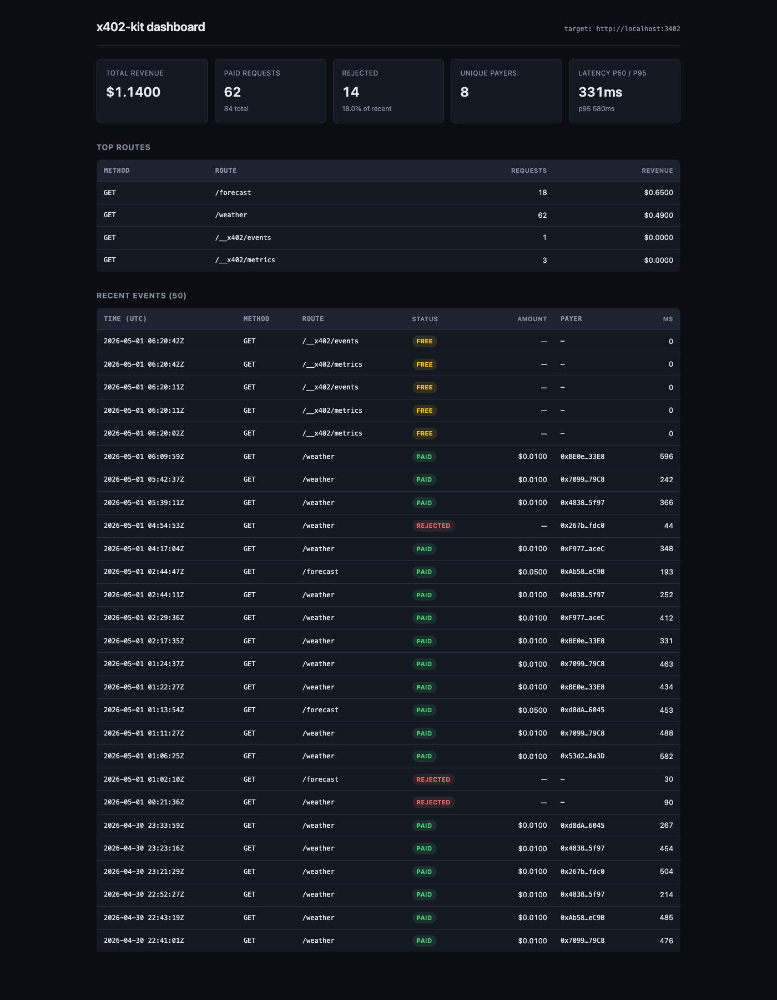

# x402-kit

> Deploy a paywalled API in 5 minutes. YAML route config, SQLite analytics, settlement webhooks — all built on Coinbase's [x402](https://x402.org) payment protocol.

[](https://github.com/kite-agent/x402-kit/actions/workflows/ci.yml)
[]()
[]()

`@x402/express` gives you a low-level middleware. **`x402-kit` gives you a paywall product.** YAML pricing, persistent usage logs, settlement webhooks, an analytics dashboard, and an example you can deploy today.



*The `@x402-kit/dashboard-ui` package, rendering live `/__x402/metrics` + `/__x402/events` from a running paywalled server.*

## Why x402-kit instead of `@x402/express` directly?

| Concern | `@x402/express` | `x402-kit` |
|---|---|---|
| Per-route pricing | hand-coded JS object | declarative YAML |
| Usage tracking | none | SQLite, indexed, queryable |
| Revenue analytics | none | `/metrics` + `/events` HTTP endpoints |
| Settlement webhooks | none | one URL in YAML |
| Tests against the protocol | none | 9 passing tests, mocked facilitator |
| Time to first paywalled API | half a day | five minutes |

## 5-minute quickstart

Scaffold a fresh project, run it locally, and deploy it to Fly.io with three commands:

```bash
npx x402-kit init my-paywall
cd my-paywall && npm install && npm run dev          # local
npx x402-kit deploy --launch                         # public on Fly.io
```

The `deploy` step writes a `Dockerfile`, `fly.toml`, and `.dockerignore` from your `x402-kit.yaml`,
then runs `flyctl launch` + `flyctl deploy`. Run without `--launch` to just generate the files
and review them yourself.

…or wire x402-kit into an existing Express app:

```bash
npm install x402-kit express
```

Create `x402-kit.yaml`:

```yaml
payTo: "0xYourBaseAddress"
network: base
routes:
  "GET /weather":
    price: "0.01"
    description: "Current weather"
  "GET /forecast":
    price: "0.05"
    description: "5-day forecast"
```

Wire it into your Express app:

```ts
import express from "express";
import { install } from "x402-kit";

const app = express();
install(app, { config: "./x402-kit.yaml" });

app.get("/weather", async (req, res) => {
  res.json({ city: req.query.city, temp: 12 });
});

app.listen(3402);
```

That's it. Calls to `/weather` now return HTTP 402 with payment instructions, and successful payments are settled on Base via the Coinbase facilitator at `facilitator.x402.org`. Every request is logged to SQLite and exposed at `/__x402/metrics`.

## What you get out of the box

- **HTTP 402 responses** matching the x402 v1 spec (`accepts`, `scheme`, `network`, `maxAmountRequired`, `payTo`, `asset`, `extra`)
- **Local pre-validation** — bad `to`, expired auth, or insufficient `value` is rejected before the facilitator is called (saves you facilitator-rate-limit headroom)
- **Facilitator integration** — `/verify` before handing off to your route, `/settle` after the response is sent (so a slow chain never blocks the user)
- **SQLite usage log** with indexes on timestamp, route, payer, status — query revenue, top payers, error rates
- **`/__x402/metrics`** — JSON summary: total requests, paid count, rejected count, total revenue, unique payers, per-route breakdown
- **`/__x402/events`** — recent event stream (last N events with payer, tx hash, latency)
- **Settlement webhook** — fire-and-forget POST to your URL on each successful settlement (drop into Slack, Zapier, your CRM)
- **Bearer-token auth** for the analytics endpoints if you don't want them public

## Running the example

```bash
git clone <repo> x402-kit && cd x402-kit
npm install
cd packages/server && npm run build
cd ../../examples/weather-paywall && npm run build
PORT=3402 node dist/server.js

# In another terminal
curl -i 'http://localhost:3402/weather?city=Oslo'
# → HTTP 402 with payment requirements

curl 'http://localhost:3402/__x402/metrics'
# → live revenue and request counts
```

## Architecture

```
┌──────────────┐  GET /weather (no payment)        ┌──────────────┐
│              │ ────────────────────────────────► │              │
│   Client     │ ◄──── HTTP 402 + accepts[] ────── │   x402-kit   │
│              │                                   │              │
│              │  GET /weather + X-PAYMENT header  │  middleware  │
│              │ ────────────────────────────────► │              │
│              │                                   │      │       │
│              │                                   │      ▼       │
│              │                                   │ pre-validate │
│              │                                   │      │       │
│              │                                   │      ▼       │
│              │                                   │  facilitator │ ──► /verify
│              │                                   │      │       │     /settle
│              │                                   │      ▼       │
│              │ ◄──── 200 OK + your handler ───── │  your route  │
│              │                                   │      │       │
│              │                                   │      ▼       │
│              │                                   │  log + webhook
└──────────────┘                                   └──────────────┘
                                                          │
                                                          ▼
                                                   ┌──────────────┐
                                                   │  SQLite +    │
                                                   │  /__x402/*   │
                                                   └──────────────┘
```

## Configuration reference

```yaml
# Required
payTo: "0x..."                # 0x-prefixed Ethereum address (40 hex chars)
network: base                 # base | base-sepolia | polygon | arbitrum | optimism

routes:
  "GET /path":                # METHOD must be uppercase, path must start with /
    price: "0.10"             # Decimal string, up to 6 decimals (USDC precision)
    description: "..."        # Optional, shown to client in the 402 response
    network: base-sepolia     # Optional per-route override
    asset: "0x..."            # Optional ERC-20 override (defaults to USDC)
    maxTimeoutSeconds: 60     # Optional, default 60

# Optional
facilitatorUrl: "https://facilitator.x402.org"  # Default: Coinbase's hosted facilitator
dbPath: "./x402-kit.db"                          # Default ./x402-kit.db, or ":memory:" for tests
settlementWebhook: "https://your-app/webhook"    # Optional POST after each settlement
```

## Status

- **Server middleware** — shipped, 9/9 tests passing
- **Example server** — shipped (Open-Meteo weather paywall on Base Sepolia)
- **Analytics endpoints** — shipped (`/__x402/metrics`, `/__x402/events`, `/__x402/health`)
- **CLI scaffolder** — shipped, 7/7 tests passing (`npx x402-kit init <name>`)
- **CLI deploy** — shipped, 11/11 tests passing (`npx x402-kit deploy [--launch]` writes Dockerfile + fly.toml; one-shot Fly.io deploy)
- **Dashboard client** — shipped, 14/14 tests passing (`@x402-kit/dashboard` typed client + aggregation helpers)
- **Hosted dashboard UI** — shipped (`@x402-kit/dashboard-ui`, Next.js 14 App Router; `cd packages/dashboard-ui && npm run dev` — see screenshot above)
- **Live demo deployment** — in progress (Dockerfile + Fly.io config + mainnet YAML shipped; see [`examples/weather-paywall/README.md`](examples/weather-paywall/README.md))
- **Demo data seeder** — shipped (`npm run seed:demo -w x402-kit-example-weather-paywall` populates the analytics db with realistic synthetic events for screenshots and live previews)
- **CI** — shipped (`.github/workflows/ci.yml` runs typecheck + tests on Node 22 and 24 against every push/PR; badge above goes green the moment the repo lands on GitHub)

## License

MIT
